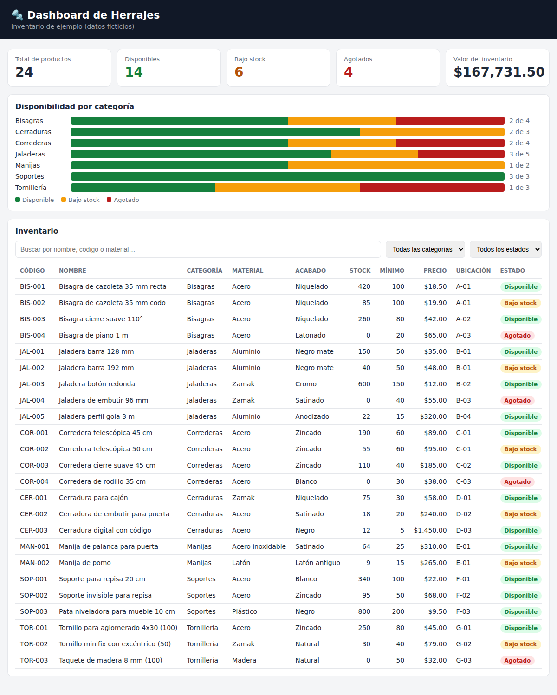

# Dashboard de Herrajes (Google Apps Script)

App web sencilla que muestra un inventario de herrajes (datos ficticios): cuántos hay
disponibles, cuáles tienen poco stock y cuáles están agotados.



## Qué incluye

- **Tarjetas de resumen**: total de productos, disponibles, bajo stock, agotados y valor del inventario.
  Si le das clic a una tarjeta, la tabla se filtra por ese estado.
- **Gráfica por categoría**: bisagras, jaladeras, correderas, etc., en verde/amarillo/rojo.
- **Tabla con buscador** y filtros por categoría y estado.

Estados:
- **Disponible**: hay más piezas que el mínimo.
- **Bajo stock**: quedan piezas, pero igual o menos que el mínimo.
- **Agotado**: 0 piezas.

## Cómo ponerlo a funcionar (sin saber programar)

Solo necesitas copiar y pegar 2 archivos: `Code.gs` e `Index.html`.

1. Entra a <https://script.google.com> con tu cuenta de Google y haz clic en **Nuevo proyecto**.
2. Arriba a la izquierda cambia el nombre "Proyecto sin título" por **Dashboard de Herrajes**.
3. **Archivo Code.gs**: ya viene uno creado. Borra todo lo que tiene y pega el contenido
   de [`Code.gs`](Code.gs) de este repositorio.
4. **Archivo Index.html**: junto a "Archivos" da clic en el **+** → **HTML**, y ponle de nombre
   exactamente `Index` (sin `.html`, Google se lo agrega solo). Borra lo que trae y pega el
   contenido de [`Index.html`](Index.html).
5. Guarda con el ícono del disquete (o `Ctrl + S`).
6. Arriba a la derecha: **Implementar** → **Nueva implementación**.
   - En el engrane ⚙️ junto a "Seleccionar tipo", elige **Aplicación web**.
   - *Ejecutar como*: **Yo**.
   - *Quién tiene acceso*: **Solo yo** (o "Cualquier usuario" si quieres compartirla).
   - Clic en **Implementar**. La primera vez te pedirá **Autorizar acceso**: elige tu cuenta,
     y si sale "Google no verificó esta app" da clic en **Configuración avanzada** →
     **Ir a Dashboard de Herrajes** → **Permitir**. (Es normal: la app es tuya.)
7. Copia la **URL de la aplicación web** que te da y ábrela en el navegador. ¡Listo!

> Tip: para ver cambios mientras editas, usa **Implementar → Probar implementaciones** y abre
> esa URL (termina en `/dev`). La URL normal solo se actualiza al hacer
> **Implementar → Gestionar implementaciones → ✏️ → Versión: Nueva versión**.

## Cómo cambiar los datos

En `Code.gs` está la lista `HERRAJES`. Cada renglón es un producto, en este orden:

```
código, nombre, categoría, material, acabado, stock, mínimo, precio, ubicación
```

Puedes cambiar números, agregar renglones (copiando uno existente) o borrar los que no uses.
Cuida que cada renglón termine en coma, excepto el último.
